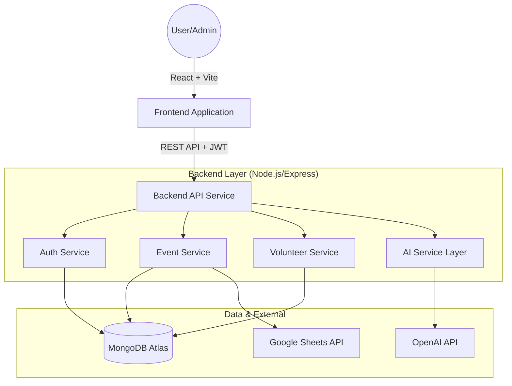
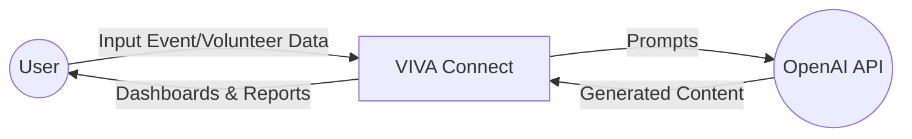
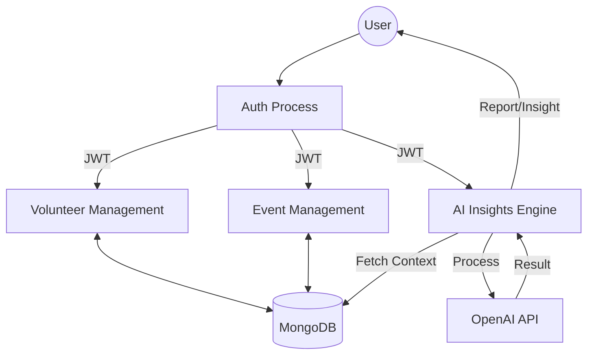
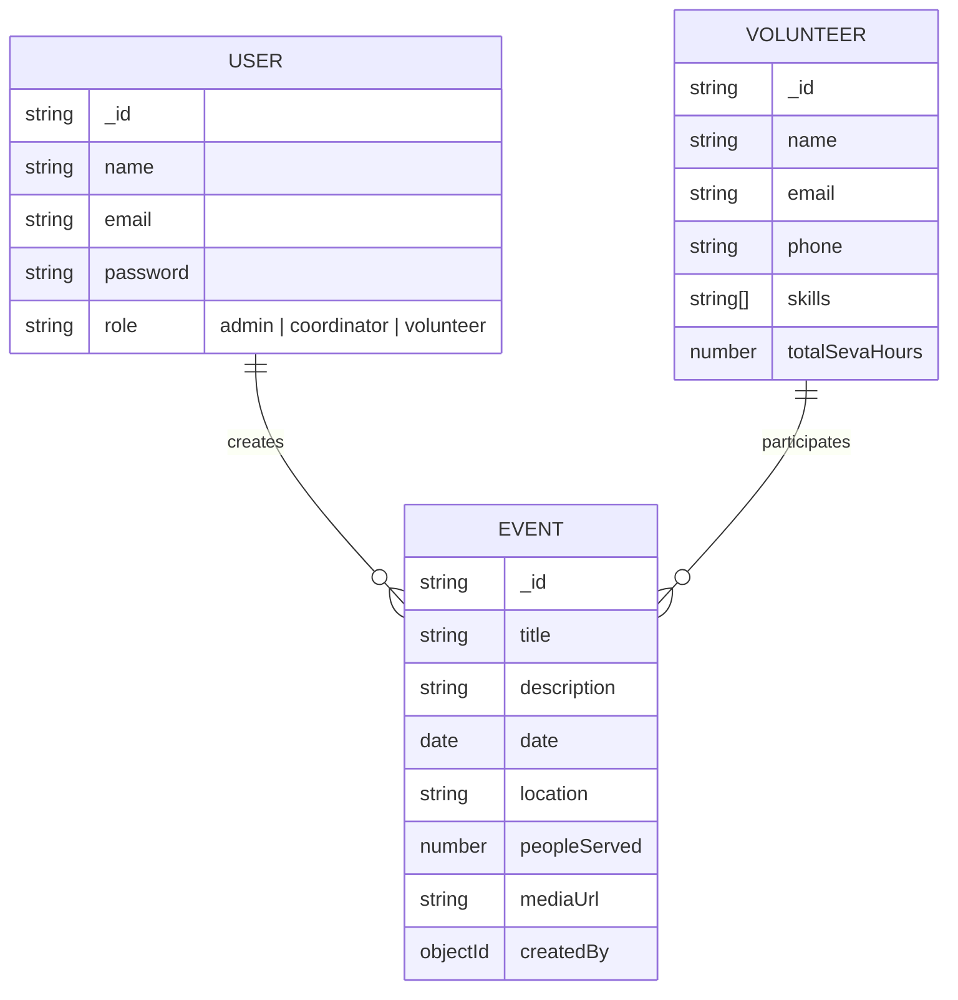
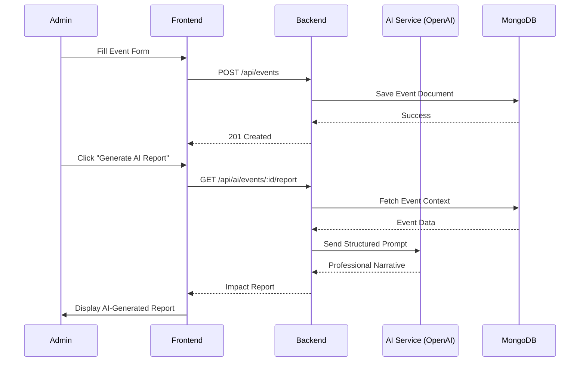

# Software Requirements Specification (SRS) - VIVA Connect

## 0. Document Control

| **Field** | **Details** |
| :--- | :--- |
| **Project Name** | VIVA Connect |
| **Lead Engineer** | **HP** (Senior System Architect) |
| **Organization** | VIVA / Ramakrishna Mission |
| **Version** | 1.0.0 (Phase 1 Baseline) |
| **Status** | Approved / Production-Ready |
| **Date** | May 2, 2026 |

---

## 1. Introduction

### 1.1 Purpose
The purpose of this document is to provide a detailed overview of the **VIVA Connect** platform. VIVA Connect is an Operations, Automation, and Learning Intelligence System designed to digitize community seva, automate administrative tasks, and provide actionable AI-driven insights for mission-driven organizations like VIVA under Ramakrishna Mission.

### 1.2 Scope
VIVA Connect facilitates:
- **Volunteer Management**: Profile tracking, skill mapping, and participation history.
- **Event & Impact Tracking**: Lifecycle management of events and real-time impact metrics.
- **AI Assistance**: Automated reporting, dashboard insights, and intelligent volunteer recommendations.
- **Operations Automation**: Secure data handling and centralized coordination.

---

## 2. System Architecture

VIVA Connect follows a modern **MERN** (MongoDB, Express, React, Node.js) architecture with a dedicated **AI Service Layer**.

### 2.1 High-Level Architecture Diagram



### 2.2 Architectural Components
- **Frontend**: A responsive SPA built with React 18, utilizing Tailwind CSS for premium aesthetics and Framer Motion for micro-animations.
- **Backend**: A robust Express.js server implementing centralized middleware for security (Helmet, HPP, Rate Limiting).
- **Database**: MongoDB Atlas for scalable, document-oriented data storage.
- **AI Layer**: Integration with OpenAI (GPT-4o-mini) for intelligent text generation and data interpretation.

---

## 3. Data Flow Diagrams (DFD)

### 3.1 Context Diagram (Level 0)



### 3.2 Level 1 DFD: System Processes



### 3.3 Level 2 DFD: AI Service Flow

```mermaid
graph TD
    Req[AI Insight Request] --> Validate{Valid JWT?}
    Validate -->|No| Err[401 Unauthorized]
    Validate -->|Yes| Fetch[Fetch Stats/Context from MongoDB]
    Fetch --> Prompt[Construct Structured Prompt]
    Prompt --> API[Call OpenAI GPT-4o-mini]
    API --> Parse[Parse & Sanitize JSON/Text]
    Parse --> Cache[Cache Result (Optional)]
    Parse --> Res[Send Response to Frontend]
```

---

## 4. Entity-Relationship Diagram (ERD)



---

## 5. Functional Requirements

### 5.1 Authentication & Security
- **RBAC (Role-Based Access Control)**: Support for Admin, Coordinator, and Volunteer roles.
- **Secure Storage**: Passwords hashed using `bcrypt`.
- **JWT Authorization**: All protected routes require a valid Bearer token.

### 5.2 Event & Volunteer Management
- **CRUD Operations**: Complete management of events and volunteers.
- **Skill Mapping**: Ability to tag volunteers with specific skills for better event matching.
- **Impact Metrics**: Tracking of "People Served" and "Seva Hours".

### 5.3 AI-Powered Intelligence
- **Smart Impact Report**: Generates professional narratives for completed events.
- **Volunteer Recommendation**: Suggests top 3 volunteers for an event based on skills and history.
- **Dashboard Insights**: Analyzes organizational trends to provide actionable advice.

---

## 6. User Journey (Sequence Diagram)

### 6.1 Creating an Event & Generating Impact Report



---

## 7. Future Development & Maintenance

### 7.1 Enhancement Plan (Phase 2 & Beyond)
- **Learning Intelligence**: Integration of the "Course Content Assistant" to generate module breakdowns and objectives.
- **Mobile Ecosystem**: Development of a React Native app for volunteers to check-in/out via QR codes.
- **Advanced Recommendations**: Implementing vector-based matching (RAG) for more complex volunteer-event alignment.
- **Analytics v2**: Predictive modeling for volunteer churn and event resource optimization.

### 7.2 Maintenance Techniques
- **Automated Health Checks**: Dedicated `/api/health` routes monitoring DB and external API status.
- **Security Audits**: Bi-weekly dependency scanning and automated sanitization via `express-mongo-sanitize` and `hpp`.
- **Scalability**: Stateless architecture ready for containerization (Docker) and horizontal scaling.
- **Backups**: Daily automated snapshots via MongoDB Atlas and exportable CSV/JSON utilities for impact data.

---

## 8. Non-Functional Requirements

- **Performance**: API response times < 200ms (excluding AI calls); frontend optimized for mobile-first usage.
- **Availability**: High availability via cloud hosting (Render/MongoDB Atlas).
- **Usability**: Premium dark-mode interface with a focus on "Eye-Safe" design for late-night coordination.

---

## 9. Tech Stack Summary

- **Frontend**: React, Vite, Tailwind CSS, Framer Motion, Lucide Icons.
- **Backend**: Node.js, Express, Mongoose, Zod.
- **Database**: MongoDB Atlas.
- **External**: OpenAI API, Google Sheets API.
